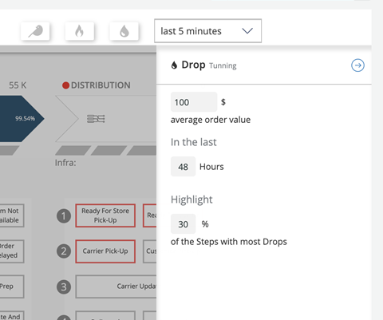
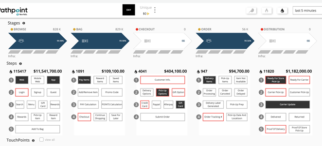

## Implementation of Background service for Drop Filter  
The Drop filter shows the amount of drops per stage with their monetary equivalents according to the values set in the tunning. It also shows the steps that are causing drops.  
There is a menu that shows up by clicking on the Drop icon.  
  
Clicking on the blue arrow in the right corner saves the changes.  
  
For the Drops calculation, it was created a new type of Touchpoint called DRP, which works to make the count of drops.  
