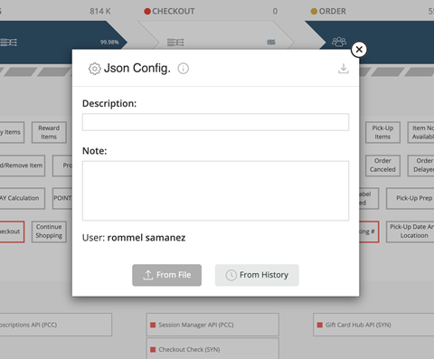
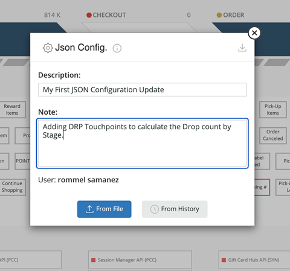
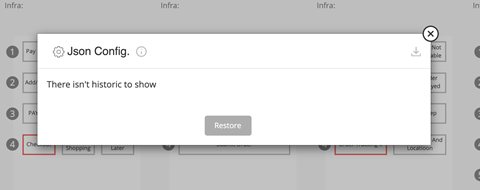
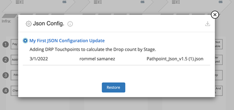

## History tracking and JSON config 

JSON config has two ways to be uploaded. It can be done from file or from previous uploads that are tracked in the history. 

 
To upload from file, the fields of Description and Note should be filled in order to be able to select the JSON from the files. It also shows the user that is currently uploading the JSON.

 
Once selected the file and validated, modal dismisses and install occurs automatically.  
Every upload is being tracked and saved in the history, which can be restored and installed.   
If there is not any file to restore, it shows as in the following image.  
 
To restore from history, it is needed to select the file and click on restore. It installs the JSON automatically with the selected version. 
 
In the history can be seen the Description and note added when the upload was made. It also shows the date, the user and the file name. On the top right corner is the download button. 
The info icon takes to a read me file of Pathpoint documentation. 
 
