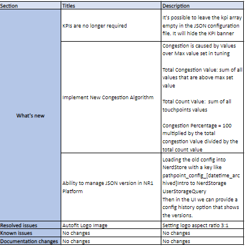

## Release notes
### Date December 13th to January 7th  
Version number  
## What’s new   
•	KPIs are no longer required  
Description: It's possible to leave the kpi array empty in the JSON configuration file. It will hide the KPI banner  
•	Implement New Congestion Algorithm  
Description: Congestion is caused by Values over Max value set in tuning   
Total Congestion Value: sum of all values that are above max set value  
Total Count Value: sum of all touchpoints values  
Congestion Percentage = 100 multiplied by the total congestion Value divided by the total count value  
•	Ability to manage JSON version in NR1 Platform  
Description: Loading the old config into NerdStore with a key like pathpoint_config_[datetime_archived]Intro to NerdStorage UserStorageQuery Then in the UI we can provide a config history option that shows the versions.  
## Resolved issues 
•	Autofit Logo Image  
Description: Setting logo aspect ratio 3:1  
## Known issues 
•	No changes  
•	Documentation changes No changes  
## Congestion Documentation 

A new way to calculate congestion is implemented, based on the formule developed. 
•	It uses the Count touchpoints, PCC and PRC
•	It adds a new property to the tuning, defining the max acceptable value. 
## "Max transaction Count” in the figure

